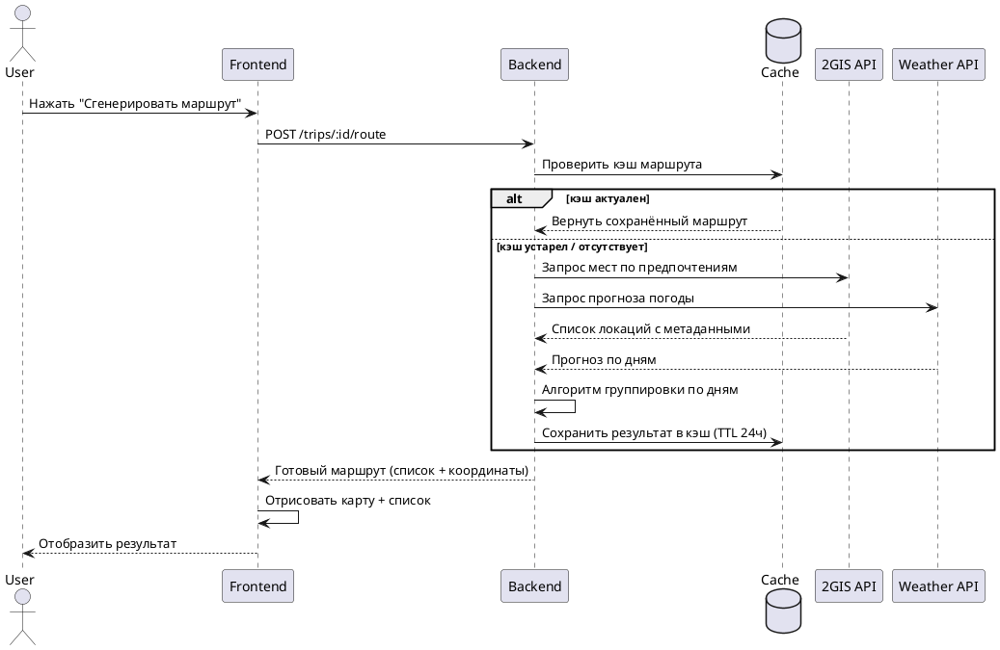
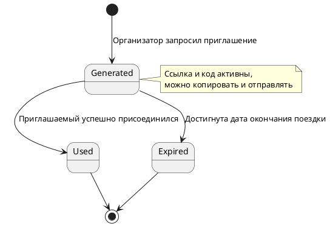

# Функциональные требования

## UC-01: Создание новой поездки

| Параметр | Значение |
|----------|----------|
| **ID** | UC-01 |
| **Название** | Создание новой поездки |
| **Акторы** | Зарегистрированный пользователь (организатор) |
| **Предусловия** | Пользователь авторизован и находится на главном экране |

### 🟢 Основной поток

1. Пользователь инициирует создание поездки.
2. Система отображает форму с полями:
   - **Город** (обязательно)
   - **Даты** (обязательно, формат ДД.ММ.ГГГГ)
   - **Бюджет** (опционально, выбор из предустановленных диапазонов: «бюджетная», «1000–5000₽», «5000–10000₽» и т.д.)
3. Пользователь заполняет обязательные поля и переходит к следующему шагу.
4. Система предлагает выбрать предпочтения:
   - Типы мест: музеи, природа, развлечения
   - Питание: не добавлять / столовые / кафе / рестораны
5. Пользователь подтверждает выбор и запрашивает создание поездки.
6. Система валидирует данные:
   - Даты в корректном формате
   - Дата начала ≥ сегодня
   - Дата окончания ≥ дата начала
7. Система сохраняет поездку в БД, присваивает уникальный идентификатор.
8. Пользователь перенаправляется на страницу созданной поездки.

### 🟡 Альтернативные потоки

| Шаг | Условие | Действие системы |
|-----|---------|-----------------|
| 3.1 | Пользователь не заполнил обязательные поля | Подсветка ошибок, блокировка перехода до исправления |
| 5.1 | Пользователь не выбрал предпочтения | Использование значений по умолчанию: «развлечения» + «кафе» |

### 🔴 Исключительные потоки

| Шаг | Ошибка | Реакция системы |
|-----|--------|-----------------|
| 7.1 | Ошибка сохранения в БД | Сообщение: «Не удалось создать поездку. Попробуйте позже». Данные не сохраняются. |

### Постусловия

| Исход | Результат |
|-------|-----------|
| ✅ Успех | Запись о поездке создана в БД. Пользователь назначен владельцем. |
| ❌ Неудача | Пользователь остаётся на форме, видит сообщение об ошибке с указанием проблемного поля. |

### Бизнес-правила

```
BR-01: Название поездки генерируется автоматически: "Поездка в [Город]"
BR-02: Максимальная длительность поездки — 10 дней
BR-03: Пользователь может редактировать параметры поездки в любое время до её начала
```

## UC-02: Генерация маршрута по дням

| Параметр | Значение |
|----------|----------|
| **ID** | UC-02 |
| **Название** | Генерация маршрута |
| **Акторы** | Пользователь (участник), система, внешние API (карты, погода, места) |
| **Предусловия** | Поездка создана и сохранена в системе |

### 🟢 Основной поток

1. Пользователь открывает страницу поездки и нажимает «Сгенерировать маршрут».
2. Система загружает параметры поездки: город, даты, предпочтения, бюджет.
3. Система параллельно запрашивает внешние данные:
   - 🌤️ Прогноз погоды на даты поездки
   - 🏛️ Список мест (достопримечательности, кафе, музеи), соответствующих предпочтениям
4. Алгоритм группирует места по дням с учётом:
   - Географической близости (логистика)
   - Времени работы заведений
   - Погодных условий (дождь → приоритет крытым локациям)
   - Рекомендованного времени посещения
5. Система размещает координаты мест на интерактивной карте:
   - Каждый день — свой цвет маркеров
   - Линии соединяют точки в порядке посещения
6. Пользователю отображается:
   - Список локаций по дням с тайм-слотами
   - Интерактивная карта с маршрутом
   - Сводка по погоде на каждый день

### 🟡 Альтернативные потоки

| Шаг | Условие | Действие системы |
|-----|---------|-----------------|
| 3.1 | Один из внешних API недоступен | Использование кэшированных данных или пропуск источника; уведомление пользователя о неполных данных |

### 🔴 Исключительные потоки

| Шаг | Ошибка | Реакция системы |
|-----|--------|-----------------|
| 3.1 | Критическая ошибка всех внешних API | Сообщение: «Не удалось загрузить данные для построения маршрута. Попробуйте позже». |

### Постусловия

| Исход | Результат |
|-------|-----------|
| ✅ Успех | Маршрут сохранён и привязан к поездке. Доступен для просмотра и редактирования. |
| ❌ Неудача | Пользователь видит ошибку и может повторить попытку позже. |

### Бизнес-правила

```
BR-01: Количество дней в маршруте = длительности поездки
BR-02: На каждый день предлагается не более 5–7 локаций
BR-03: Система может генерировать разные варианты маршрута при повторных запросах
BR-04: Генерация запускается только по явному запросу пользователя (не автоматически)
BR-05: При плохой погоде система приоритезирует крытые локации
```

### Диаграмма последовательности



## UC-03: Приглашение участников в поездку

| Параметр | Значение |
|----------|----------|
| **ID** | UC-03 |
| **Название** | Приглашение участников в поездку |
| **Акторы** | Организатор (авторизован), приглашаемый (может быть неавторизован) |
| **Предусловия** | Поездка создана, организатор находится на её странице |

### 🟢 Основной поток

1. Организатор нажимает «Пригласить участников».
2. Система генерирует и отображает:
   - Уникальную ссылку-приглашение
   - Одноразовый код для ручного ввода
3. Организатор копирует ссылку или код и отправляет приглашаемому любым способом (мессенджер, почта и т.д.).
4. Приглашаемый:
   - Переходит по ссылке **или**
   - Вводит код в поле «Присоединиться» на сайте
5. Система проверяет статус авторизации пользователя:
   - ✅ Авторизован → переход к шагу 6
   - ❌ Не авторизован → перенаправление на вход/регистрацию с сохранением контекста приглашения
6. Система добавляет пользователя в список участников поездки.
7. Отображается сообщение об успешном присоединении, пользователь перенаправляется на страницу поездки.
8. Все участники видят обновлённый состав команды.

### 🟡 Альтернативные потоки

| Шаг | Условие | Действие системы |
|-----|---------|-----------------|
| 4.1 | Ссылка уже использована | Сообщение: «Эта ссылка уже была использована. Запросите новую у организатора». |
| 5.1 | Пользователь не авторизован | Перенаправление на вход/регистрацию; после успеха — автоматическое присоединение к поездке. |
| 5.2 | Пользователь уже в поездке | Сообщение: «Вы уже присоединились к этой поездке» + перенаправление на её страницу. |

### 🔴 Исключительные потоки

| Шаг | Ошибка | Реакция системы |
|-----|--------|-----------------|
| 2.1 | Ошибка генерации ссылки/кода | Сообщение: «Не удалось создать приглашение. Попробуйте позже или используйте другой способ». |

### Постусловия

| Исход | Результат |
|-------|-----------|
| ✅ Успех | Приглашённый пользователь добавлен в поездку с ролью «участник» (права: просмотр и редактирование маршрута). |
| ❌ Неудача | Пользователь не добавлен, видит сообщение об ошибке и варианты действий. |

### Бизнес-правила

```
BR-01: Ссылка-приглашение действительна до первого использования ИЛИ до даты окончания поездки
BR-02: Один пользователь может быть участником одной поездки только один раз
BR-03: После успешного использования ссылка/код деактивируются автоматически
```

### Диаграмма состояния приглашения


