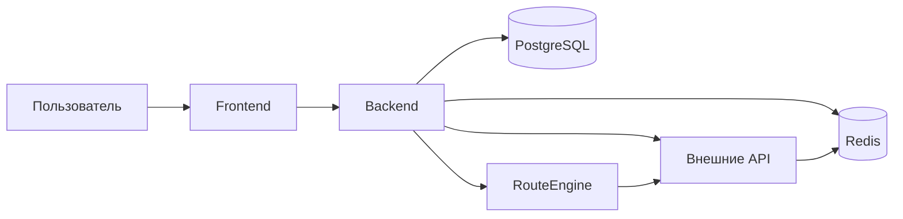

# Архитектура TripTie

## 🧱 Стиль архитектуры: Модульный монолит

```
┌─────────────────────────────────┐
│         Клиент (React)          │
└─────────┬───────────────────────┘
          │ HTTPS / WebSocket
┌─────────▼───────────────────────┐
│         Backend (Node.js)       │
│  ┌─────────────────────────┐    │
│  │   Модуль: Auth          │    │
│  │   Модуль: Trips         │    │
│  │   Модуль: RouteEngine   │    │
│  │   Модуль: Integrations  │    │
│  └─────────────────────────┘    │
└─────────┬───────────────────────┘
          │
   ┌──────┴──────┐
   ▼             ▼
┌──────┐   ┌──────────┐
│Post- │   │  Redis   │
│greSQL│   │ (кэш)    │
└──────┘   └──────────┘
```

### Почему модульный монолит?

| Критерий | Решение |
|----------|---------|
| Скорость разработки | Один репозиторий, общий контекст, проще деплой |
| Чёткие границы | Код сгруппирован по доменам, легко вынести в микросервис при росте |
| Минимум горизонтальных связей | Модули общаются через чёткие интерфейсы, не лезут в БД друг друга |
| Готовность к масштабированию | При необходимости модуль RouteEngine можно выделить в отдельный сервис без переделки всего кода |

## 🔗 Основные компоненты

| Компонент | Ответственность | Технологии |
|-----------|----------------|------------|
| **Frontend** | UI, карта, формы, WebSocket-клиент | React, Leaflet/Yandex Maps API, Socket.io-client |
| **Backend** | Бизнес-логика, API, оркестрация внешних вызовов | Node.js (Express), TypeScript |
| **RouteEngine** | Алгоритм генерации маршрута (эвристики + правила) | Python (отдельный модуль, вызов через RPC) |
| **PostgreSQL** | Хранение пользователей, поездок, маршрутов | Supabase / self-hosted |
| **Redis** | Кэш мест, сессии, rate limiting | Redis Cloud / self-hosted |
| **Integrations** | Адаптеры к внешним API (2GIS, погода, карты) | Axios, retry-логика, circuit breaker |

## 🔄 Потоки данных (упрощённо)



## 📦 Развёртывание (MVP)

- **Хостинг**: VPS (Yandex Cloud / Selectel) или PaaS (Railway, Render)
- **Контейнеризация**: Docker + docker-compose для локальной разработки
- **CI/CD**: GitHub Actions (тесты → сборка → деплой на staging → ручной апрув → prod)
- **Мониторинг**: UptimeRobot + логи в файл (в будущем — Prometheus/Grafana)
