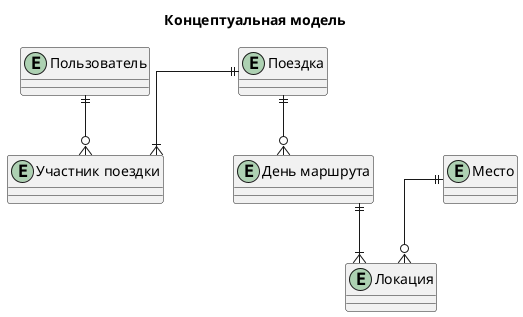
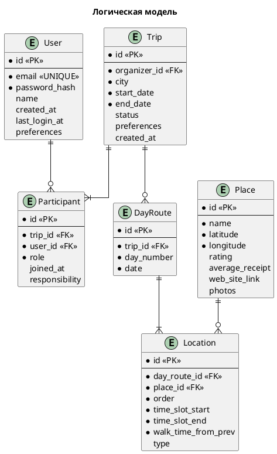
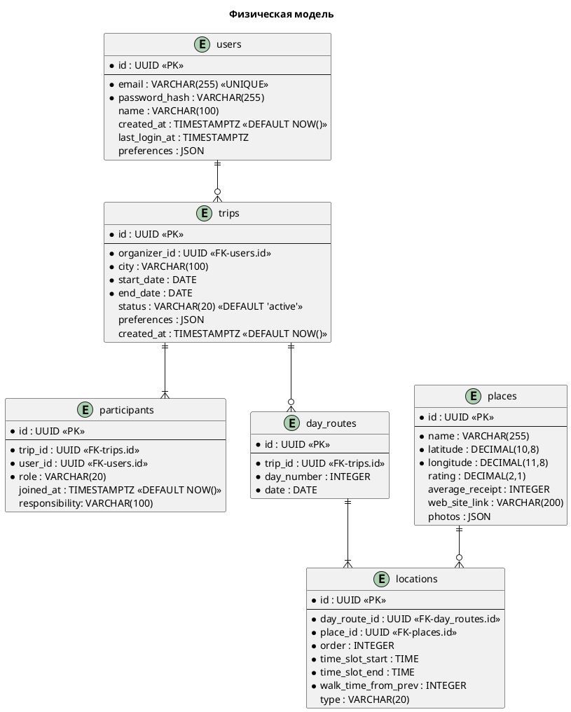

# Модель данных и технологии хранения

## Описание сущностей

### Пользователь (User)
**Атрибуты:**
- `id` (UUID) — уникальный идентификатор
- `email` (string) — адрес электронной почты
- `passwordHash` (string) — хэш пароля
- `name` (string) — отображаемое имя
- `createdAt` (datetime) — дата регистрации
- `lastLoginAt` (datetime) — дата последнего входа
- `preferences` (JSON) — глобальные настройки (язык, валюта, тема)

**Акторы:**
- Пользователь (CRUD своих данных)
- Система (регистрация, аутентификация)
- Организатор/участники поездки (чтение профилей)

**Характер взаимодействия:**
- Высокая частота чтения при аутентификации, редкая запись
- Сильная консистентность для безопасности
- Объём: ~5 000–10 000 записей на этапе MVP

### Поездка (Trip)
**Атрибуты:**
- `id` (UUID) — уникальный идентификатор
- `organizerId` (UUID) — владелец поездки
- `city` (string) — город назначения
- `startDate` / `endDate` (date) — даты поездки
- `status` (enum) — `active`, `completed`
- `preferences` (JSON) — предпочтения группы (бюджет, программа, питание)
- `createdAt` (datetime)

**Акторы:**
- Организатор (создание, редактирование, удаление)
- Участники (чтение, изменение своих предпочтений)
- Система (чтение для генерации маршрута)

**Характер взаимодействия:**
- Умеренная частота CRUD-операций
- Связи: 1:N с участниками и днями маршрута
- Объём: до 100 000–200 000 записей при масштабировании

### Маршрут дня (DayRoute)
**Атрибуты:**
- `id` (UUID)
- `tripId` (UUID)
- `dayNumber` (int)
- `date` (date)
- `locations` (array) — массив локаций за день

**Акторы:**
- Система (генерация, обновление)
- Пользователь (просмотр, запрос перегенерации)

**Характер взаимодействия:**
- Низкая частота записи, высокая частота чтения
- Генерация по запросу, кэширование результата

### Локация в маршруте (Location)
**Атрибуты:**
- `id` (UUID)
- `dayRouteId` (UUID)
- `placeId` (UUID) — ссылка на справочник мест
- `type` (enum) — `museum`, `park`, `cafe`, `restaurant`, `entertainment`
- `order` (int) — порядок посещения в рамках дня
- `timeSlotStart` / `timeSlotEnd` (time)
- `walkTimeFromPrev` (int) — минуты от предыдущей точки

**Акторы:**
- Система (создание при генерации)
- Пользователь (ручное редактирование, перестановка)

**Характер взаимодействия:**
- Частое редактирование пользователями
- Требует JOIN с `Place` для отображения деталей
- Объём: ~1–2 млн записей (5–7 локаций × 250k поездок)

### Место (Place)
**Атрибуты:**
- `id` (UUID)
- `name` (string)
- `coordinates` (lat, lon)
- `rating` (float 0–5)
- `averageReceipt` (int)
- `webSiteLink` (string)
- `photos` (array of URLs)

**Акторы:**
- Система (кэширование из внешних API)
- Пользователь (чтение)

**Характер взаимодействия:**
- Редкая запись (обновление кэша), частое чтение
- Источники: 2GIS, Яндекс.Карты, TripAdvisor
- Объём MVP: 2 000–5 000 уникальных мест

### Детали места (PlaceDetails)
**Атрибуты:**
- Все атрибуты `Place` (наследование)
- `description` (text)
- `address` (string)
- `openingHours` (array: day, open, close)

**Акторы:**
- Пользователь (чтение при открытии карточки места)
- Система (подгрузка по требованию)

**Характер взаимодействия:**
- Ленивая загрузка, редкое обновление кэша
- Объём пропорционален базовым местам

### Участник поездки (Participant)
**Атрибуты:**
- `id` (UUID) — идентификатор пользователя
- `tripId` (UUID)
- `role` (enum) — `organizer`, `member`
- `responsibility` (string) — зона ответственности
- `joinedAt` (datetime)

**Акторы:**
- Система (добавление в состав)
- Пользователь (просмотр списка, редактирование своих данных)

**Характер взаимодействия:**
- Супер-редкая запись (только при вступлении)
- Используется для отображения состава команды и прав доступа

## Выбор технологий хранения

### Анализ требований

| Критерий | Пользователи, Поездки, Маршруты | Места (кэш), Сессии | Логи, аналитика, бэкапы, медиа |
|----------|--------------------------------|---------------------|--------------------------------|
| **Объём данных** | 1–5 ГБ (линейный рост) | ~1 ГБ (умеренный) | 100–500 ГБ (быстрый рост) |
| **Паттерн доступа** | OLTP (мелкие транзакции) | Key-Value Lookup | Event Streaming + OLAP |
| **Консистентность** | Strong (критично для прав и маршрутов) | Eventual (кэш допустим) | Weak + Eventual |
| **Доступность** | 99.9–99.99% | 99.9% | 99.9% |
| **Мутабельность схемы** | Жёсткая (стабильные поля) | Гибкая (JSON-атрибуты) | Гибкая (новые метрики) |
| **Транзакции** | Да (атомарное создание поездки + участников) | Нет | Нет |
| **Поиск и запросы** | Сложные JOIN, фильтрация по датам/статусам | Быстрая фильтрация по координатам/тегам | Агрегация, временные ряды |
| **Стоимость** | Open-source (бесплатно) | In-memory / Doc DB | Open-source + Object Storage |
| **Итоговое решение** | **PostgreSQL** | **Redis + MongoDB** | **ClickHouse + S3** |

### Обоснование выбора

#### PostgreSQL (основная БД)
- Поддержка ACID-транзакций критична для создания поездок и управления правами участников
- Нативная работа с JSONB позволяет хранить гибкие предпочтения без нарушения схемы
- Индексы по `tripId`, `userId`, `status`, `date` обеспечивают быстрый поиск
- Бесплатная лицензия, активное сообщество, совместимость с Supabase/облаками

#### Redis + MongoDB (кэш и справочники)
- **Redis**: сессии, временные токены приглашений, кэш маршрутов (TTL 24ч), счётчики запросов к API
- **MongoDB**: хранение детализированных данных о местах с гибкой схемой (меню кафе, билеты, атрибуты)
- Eventual consistency допустима: пользователь видит кэш, а не实时-данные из 2GIS

#### ClickHouse + S3 (аналитика и медиа)
- **ClickHouse**: агрегация действий пользователей, метрики конверсии, обучение рекомендательных моделей
- **S3 / Яндекс.Облако Object Storage**: фотографии мест, бэкапы БД, экспорт маршрутов в PDF
- Разделение OLTP и OLAP нагрузок предотвращает деградацию основного API

## Индексы и оптимизация

| Таблица | Индексы | Назначение |
|---------|---------|------------|
| `users` | `email` (UNIQUE) | Аутентификация, поиск |
| `trips` | `organizer_id`, `status`, `start_date` | Фильтрация поездок, календарь |
| `participants` | `user_id`, `trip_id` (COMPOSITE UNIQUE) | Проверка дубликатов, права доступа |
| `day_routes` | `trip_id`, `date` | Быстрая загрузка маршрута по дням |
| `locations` | `day_route_id`, `place_id`, `order` | Сортировка точек, JOIN с Place |
| `places` | `coordinates` (GEO), `rating`, `type` | Гео-поиск, фильтрация по категориям |

## Модели данных

В этом разделе представлены три уровня проектирования базы данных: концептуальный, логический и физический. Каждый уровень сопровождается PlantUML-кодом для версионирования и возможностью автоматической генерации диаграмм.

### 1. Концептуальная модель

**Обоснование:**
- Выделено 6 сущностей, полностью покрывающих функциональные требования MVP
- Связи отражают бизнес-логику: `Пользователь → Участник → Поездка → Дни маршрута → Локации → Места`
- Сущность `Участник поездки` реализует связь M:N между пользователем и поездкой, храня метаданные вступления (роль, дата, зона ответственности)
- `Место` и `Локация` разделены: `Место` — глобальный справочник (кэш внешних API), `Локация` — конкретная точка в расписании маршрута с тайм-слотами и порядком

### 2. Логическая модель

**Обоснование:**
- `User`: пароль хранится только в виде хэша; поле `preferences` использует JSON для гибкой настройки без изменения схемы
- `Participant`: промежуточная таблица для реализации связи M:N, содержит атрибуты роли и ответственности
- `Place`: справочник мест, нормализован для связи с внешними сервисами и кэширования
- Все первичные ключи обозначены как `<<PK>>`, внешние — как `<<FK>>`, уникальные ограничения — как `<<UNIQUE>>`

### 3. Физическая модель

**Обоснование:**
- Все таблицы используют `UUID` для первичных и внешних ключей — повышает безопасность и упрощает распределённую генерацию ID
- `VARCHAR(255)` для email соответствует стандарту RFC 5321
- JSON-поля (`preferences`, `photos`) позволяют хранить гибкие структуры без миграций схемы
- Для `longitude` выбран тип `DECIMAL(11,8)`, так как диапазон значений шире, чем у `latitude`
- Политики архивирования: завершённые поездки хранятся 3 года, после чего переносятся в холодное хранилище
