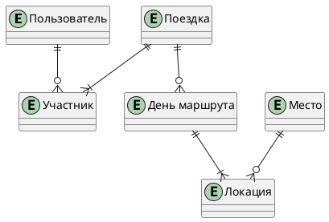

# Модель данных TripTie

## 🧭 Концептуальная модель



**Ключевые связи**:
- Один пользователь может быть организатором многих поездок
- Одна поездка имеет много участников (M:N через `Participant`)
- Одна поездка состоит из нескольких дней маршрута
- Каждый день содержит упорядоченные локации
- Локация ссылается на справочник `Place` (чтобы не дублировать данные о местах)

## 📐 Логическая модель (основные сущности)

### users
| Поле | Тип | Описание |
|------|-----|----------|
| `id` | UUID (PK) | Уникальный идентификатор |
| `email` | VARCHAR(255) (UNIQUE) | Адрес для входа |
| `password_hash` | VARCHAR(255) | bcrypt-хэш |
| `name` | VARCHAR(100) | Отображаемое имя |
| `created_at` | TIMESTAMPTZ | Дата регистрации |
| `preferences` | JSON | Глобальные настройки (язык, тема) |

### trips
| Поле | Тип | Описание |
|------|-----|----------|
| `id` | UUID (PK) | Уникальный идентификатор |
| `organizer_id` | UUID (FK → users.id) | Владелец поездки |
| `city` | VARCHAR(100) | Город поездки |
| `start_date` / `end_date` | DATE | Даты поездки |
| `status` | ENUM('active','completed') | Статус |
| `preferences` | JSON | Предпочтения группы (бюджет, категории) |

### participants (промежуточная таблица)
| Поле | Тип | Описание |
|------|-----|----------|
| `id` | UUID (PK) | |
| `trip_id` | UUID (FK) | Ссылка на поездку |
| `user_id` | UUID (FK) | Ссылка на пользователя |
| `role` | ENUM('organizer','member') | Роль в поездке |
| `joined_at` | TIMESTAMPTZ | Дата присоединения |

### places (справочник мест, кэш внешних данных)
| Поле | Тип | Описание |
|------|-----|----------|
| `id` | UUID (PK) | |
| `name` | VARCHAR(255) | Название места |
| `latitude` / `longitude` | DECIMAL | Координаты для карты |
| `rating` | DECIMAL(2,1) | Рейтинг 0–5 |
| `photos` | JSON | Массив URL изображений |
| `external_id` | VARCHAR | ID во внешней системе (2GIS и т.п.) |

> 💡 `places` не содержит всех возможных мест мира — только те, что были запрошены в контексте поездок пользователей.

## ⚙️ Физическая модель: индексы

```sql
-- Для аутентификации
CREATE UNIQUE INDEX idx_users_email ON users(email);

-- Для быстрого поиска поездок организатора
CREATE INDEX idx_trips_organizer ON trips(organizer_id);

-- Для гео-поиска мест (используется при генерации маршрута)
CREATE INDEX idx_places_coords ON places USING GIST (ll_to_earth(latitude, longitude));

-- Для фильтрации активных поездок
CREATE INDEX idx_trips_status ON trips(status) WHERE status = 'active';
```

## 🔄 Стратегия кэширования

| Данные | Где кэшируем | TTL | Инвалидация |
|--------|--------------|-----|-------------|
| Места (из 2GIS) | Redis, ключ `place:{external_id}` | 24 ч | По триггеру обновления во внешнем источнике (если доступно) |
| Прогноз погоды | Redis, ключ `weather:{city}:{date}` | 6 ч | По расписанию (cron) |
| Сгенерированные маршруты | Redis, ключ `route:{tripId}:{hash(preferences)}` | 1 ч | При изменении параметров поездки |
